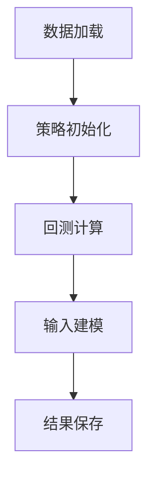

# BACKTEST MODE 功能说明文档

## 📋 目录

1. [模式概述](#模式概述)
2. [快速开始](#快速开始)
3. [策略选择与配置](#策略选择与配置)
4. [数据上传与准备](#数据上传与准备)
5. [回测执行](#回测执行)
6. [结果分析](#结果分析)
7. [高级功能](#高级功能)
8. [常见问题](#常见问题)

---

## 模式概述

### 什么是 BACKTEST MODE？

**BACKTEST MODE（历史回测模式）** 是投资组合管理系统的核心功能之一，用于分析历史数据并评估投资策略的表现。

### 核心目的

1. **历史表现评估**：基于真实历史数据测试投资策略的效果
2. **输入建模（Input Modeling）**：从标的物价格数据中提取收益率分布特征
3. **策略优化**：对比不同策略和参数配置的表现
4. **风险评估**：计算全面的风险指标，识别潜在风险

### 与 PROJECTION MODE 的关系

| 模式 | 用途 | 数据来源 |
|------|------|----------|
| **BACKTEST MODE** | 分析过去，得到历史表现和输入模型 | 历史价格数据 |
| **PROJECTION MODE** | 预测未来，使用回测中得到的输入模型模拟未来价格走向 | 输入模型参数 |

---

## 快速开始

### 操作步骤概览

系统提供了清晰的5步操作指引：

```
1️⃣ 步骤 1：选择策略 - 在左侧边栏选择投资策略
2️⃣ 步骤 2：配置参数 - 设置初始资金、杠杆、无风险利率等
3️⃣ 步骤 3：准备数据 - 上传CSV文件或使用示例数据
4️⃣ 步骤 4：运行回测 - 点击"EXECUTE BACKTEST"按钮
5️⃣ 步骤 5：查看结果 - 在6个标签页中查看详细分析
```

### 首次使用建议

对于新手用户，建议以下配置：

- ✅ **策略**：选择"Equal Weight"（等权重）策略
- ✅ **数据**：使用系统自动生成的示例数据
- ✅ **参数**：保持默认设置（初始资金 $1,000,000，杠杆 1.0x）
- ✅ **体验**：先快速运行一次，熟悉整个流程

---

## 策略选择与配置

### 可用策略列表

系统提供 **8 种投资策略**：

#### 1. Fixed Weights（固定权重策略）

**工作原理：** 按预设权重分配资产，定期再平衡保持目标权重

**适用场景：**
- ✅ 有明确的资产配置理念
- ✅ 追求长期稳定
- ✅ 不想频繁调整

**优点：**
- 简单透明，易于理解
- 成本可控，再平衡频率可调
- 长期表现稳定

**缺点：**
- 不适应市场变化
- 可能错过短期机会
- 需要定期再平衡

**参数设置：** 无特殊参数

---

#### 2. Target Risk（目标风险策略）

**工作原理：** 动态调整权重以保持目标波动率（如15%年化波动）

**适用场景：**
- ✅ 风险敏感型投资者
- ✅ 有明确的风险承受目标
- ✅ 追求风险可控

**优点：**
- 风险控制精确
- 自动调整杠杆
- 市场波动时降低仓位

**缺点：**
- 可能降低收益
- 需要频繁调整
- 对波动率估计敏感

**参数设置：**
- **Target Volatility（目标波动率）**：0.05 - 0.4（推荐 0.15）
  - 设置你能承受的最大年化波动率
  - 15% 是典型的中等风险水平

---

#### 3. Adaptive Rebalance（自适应再平衡）

**工作原理：** 仅在权重偏离阈值时再平衡，降低交易成本

**适用场景：**
- ✅ 希望降低交易成本
- ✅ 不想过度频繁交易
- ✅ 追求成本效率

**优点：**
- 交易成本低
- 减少过度交易
- 平衡收益和成本

**缺点：**
- 权重可能长期偏离
- 风险控制不如频繁再平衡
- 需要设置合适阈值

**参数设置：**
- **Rebalance Threshold（再平衡阈值）**：0.01 - 0.1（推荐 0.05）
  - 权重偏离超过5%时触发再平衡
  - 阈值越小，交易越频繁

---

#### 4. Equal Weight（等权重策略）

**工作原理：** 所有资产分配相同权重（1/N策略）

**适用场景：**
- ✅ 不确定如何分配权重
- ✅ 追求简单有效的分散化
- ✅ 初次尝试多资产投资

**优点：**
- 极其简单，无需预测
- 分散化效果好
- 学术研究显示表现不错

**缺点：**
- 忽略资产特性差异
- 可能不是最优配置
- 对资产数量敏感

**参数设置：** 无特殊参数

---

#### 5. Risk Parity（风险平价策略）

**工作原理：** 根据资产波动率分配权重，使各资产风险贡献相等

**适用场景：**
- ✅ 追求风险均衡
- ✅ 希望真正分散风险
- ✅ 不只看收益，更看风险

**优点：**
- 风险分散效果好
- 波动率低的资产权重更高
- 风险贡献均衡

**缺点：**
- 可能降低收益潜力
- 需要准确估计波动率
- 计算相对复杂

**参数设置：** 无特殊参数

---

#### 6. Minimum Variance（最小方差策略）

**工作原理：** 基于协方差矩阵优化，最小化组合波动率

**适用场景：**
- ✅ 风险厌恶型投资者
- ✅ 追求最低波动率
- ✅ 愿意牺牲部分收益换取稳定

**优点：**
- 波动率最低，风险最小
- 基于数学优化，理论最优
- 考虑资产相关性

**缺点：**
- 收益可能较低
- 需要准确的协方差矩阵
- 对数据质量要求高

**参数设置：** 无特殊参数

---

#### 7. Momentum（动量策略）

**工作原理：** 增持近期表现好的资产，减持表现差的资产

**适用场景：**
- ✅ 相信趋势延续
- ✅ 愿意跟随市场趋势
- ✅ 追求超额收益

**优点：**
- 可能捕捉趋势，获得超额收益
- 顺应市场力量
- 在趋势市场中表现好

**缺点：**
- 在震荡市场中可能表现差
- 可能追涨杀跌
- 需要设置合适的回看期

**参数设置：**
- **Lookback Periods（回看期数）**：5 - 60（推荐 20）
  - 计算动量时回看多少个交易日
  - 较短回看期更敏感，较长更稳定
- **Momentum Factor（动量因子）**：0.1 - 1.0（推荐 0.5）
  - 调整动量信号的强度
  - 值越大，调整越激进

---

#### 8. Mean Reversion（均值回归策略）

**工作原理：** 当资产偏离目标权重时反向调整，相信价格会回归均值

**适用场景：**
- ✅ 相信均值回归
- ✅ 愿意逆势操作
- ✅ 追求低买高卖

**优点：**
- 可能降低波动
- 低买高卖，成本优势
- 在震荡市场表现好

**缺点：**
- 在趋势市场中可能表现差
- 需要设置合适的回归速度
- 可能过早买入/卖出

**参数设置：**
- **Reversion Speed（回归速度）**：0.1 - 1.0（推荐 0.3）
  - 控制向目标权重回归的速度
  - 值越大，回归越快

---

### 策略选择指南

#### 根据投资目标选择：

| 投资目标 | 推荐策略 |
|---------|---------|
| 🎯 追求稳定 | Fixed Weights, Equal Weight, Minimum Variance |
| 📈 追求收益 | Momentum, Target Risk |
| ⚖️ 平衡收益风险 | Risk Parity, Adaptive Rebalance |
| 🔄 降低波动 | Mean Reversion, Minimum Variance |

#### 根据市场环境选择：

| 市场环境 | 推荐策略 |
|---------|---------|
| 📊 趋势市场 | Momentum |
| 🔁 震荡市场 | Mean Reversion |
| ⚡ 不确定 | Equal Weight, Risk Parity |

---

### 投资组合参数设置

#### 初始资金（Initial Capital）

**作用：** 决定投资组合的起始规模

**设置建议：**
- 💡 **新手测试**：$10,000 - $100,000
- 💡 **实际投资**：根据你的实际投资金额设置
- 💡 **回测验证**：可以使用任意金额，收益率不受影响

**注意事项：**
- ⚠️ 金额过小（< $1,000）可能影响计算精度
- ✅ 收益率和风险指标与初始金额无关

---

#### 杠杆比率（Leverage Ratio）

**含义：**
- **1. 0x**：无杠杆，使用自有资金投资
- **>1.0x**：使用杠杆，放大收益和风险
- **<1.0x**：保守投资，只使用部分资金

**杠杆的影响：**
- ✅ **收益放大**：盈利时收益成倍增加
- ⚠️ **风险放大**：亏损时损失也成倍增加
- ⚠️ **波动放大**：组合波动率成倍增加

**使用建议：**

| 风险偏好 | 推荐杠杆 | 风险等级 |
|---------|---------|---------|
| 💡 新手 | 1.0x（无杠杆） | 低 |
| 💡 稳健型 | 0.5x - 1.0x | 中低 |
| 💡 激进型 | 1.5x - 2.0x（需谨慎） | 中高 |
| ⚠️ 高风险 | >2.0x | 极高（可能爆仓） |

---

#### 无风险利率（Risk Free Rate）

**作用：** 用于计算风险调整收益的基准利率（Sharpe比率、Sortino比率）

**常用参考值：**

| 地区 | 参考利率 | 基准 |
|-----|---------|------|
| 🇺🇸 美国 | 2% - 3% | 10年期国债收益率 |
| 🇨🇳 中国 | 2. 5% - 3.5% | 10年期国债收益率 |
| 🇪🇺 欧洲 | 1% - 2% | 德国10年期国债 |

**设置建议：**
- 💡 **默认值**：2% - 3%
- 💡 **精确计算**：使用当前市场的10年期国债收益率
- 💡 **历史回测**：使用回测期间的平均无风险利率

---

## 数据上传与准备

### 数据格式要求

**CSV 文件格式：**

```csv
date,SPY,AGG,GLD
2020-01-01,320.5,115.2,1550.8
2020-01-02,322.1,115.5,1548.3
2020-01-03,318.9,115.8,1552.1
...
```

**格式要求：**
- ✅ 第一列必须是日期列（date、Date、DATE均可）
- ✅ 后续列为资产价格（每列代表一个资产）
- ✅ 日期格式：YYYY-MM-DD 或其他标准日期格式
- ✅ 价格为数值型

### 使用示例数据

如果不上传文件，系统会自动生成示例数据：
- 📊 包含3个资产：Stock、Bond、Gold
- 📅 数据期限：1000个交易日
- 📈 随机生成，符合正态分布

### 再平衡频率设置

**Rebalance Days（再平衡间隔天数）：** 1 - 252

| 设置值 | 频率 | 特点 |
|-------|------|------|
| 21天 | 约每月 | 推荐，平衡成本与效果 |
| 63天 | 约每季度 | 低成本，但权重偏离较大 |
| 252天 | 约每年 | 最低成本，权重偏离最大 |

**影响分析：**
- ⬆️ 频率越高：权重偏离越小，但交易成本越高
- ⬇️ 频率越低：交易成本越低，但权重可能偏离较大

---

## 回测执行

### 配置检查清单

运行回测前，系统会自动检查：
- ✅ 策略已选择
- ✅ 初始资金已设置
- ✅ 数据已准备（可使用示例数据）

### 执行回测

点击 **"🚀 EXECUTE BACKTEST"** 按钮后，系统执行以下流程：



1. **数据加载**：读取上传的CSV或生成示例数据
2. **策略初始化**：根据选择的策略创建回测配置
3. **回测计算**：
   - 计算每日组合净值
   - 根据策略调整权重
   - 记录再平衡操作
   - 计算回撤
4. **输入建模**：自动分析标的物价格数据，拟合分布模型
5. **结果保存**：保存到历史记录

### 自动输入建模

回测完成后，系统会自动进行输入建模：

**目的：** 从标的物价格数据中提取收益率分布特征，为未来价格预测提供基础

**处理流程：**
1. 提取所有资产的日收益率
2. 拟合多种分布模型（Normal、Student-t、Bootstrap等）
3. 计算拟合优度指标（KS检验、AIC、BIC）
4. 推荐最佳分布模型
5. 保存模型参数，供PROJECTION模式使用

**成功提示：**
```
✅ 输入建模完成：基于标的物价格数据，推荐使用 Normal 分布模型（将用于未来价格预测）
```

---

## 结果分析

### 核心性能指标

回测完成后，系统显示 **6 个核心指标卡片**：

#### 1. Total Return（总收益率）

**含义：** 整个回测期间的累计收益率

**Delta 显示：** CAGR（复合年化收益率）

**解读标准：**
- ✅ >0%：盈利
- ⚠️ <0%：亏损
- 📊 对比年化收益，评估长期表现

---

#### 2. Sharpe Ratio（夏普比率）

**含义：** 风险调整后收益，衡量每单位风险的超额回报

**计算公式：** 
```
Sharpe = (策略收益 - 无风险利率) / 波动率
```

**评级标准：**

| Sharpe值 | 评级 | 说明 |
|---------|------|------|
| >2 | 优秀 | 风险调整后收益非常好 |
| 1-2 | 良好 | 风险调整后收益较好 |
| 0-1 | 一般 | 风险调整后收益一般 |
| <0 | 较差 | 表现不如无风险资产 |

---

#### 3. Sortino Ratio（索提诺比率）

**含义：** 下行风险调整收益，只考虑负收益的波动

**优势：** 比Sharpe更适合评估非对称收益分布

**解读：**
- 值越高越好
- 通常高于Sharpe比率（因为只惩罚下行波动）
- 更关注投资者实际关心的下行风险

---

#### 4. Calmar Ratio（卡玛比率）

**含义：** 年化收益 / 最大回撤

**计算公式：**
```
Calmar = 年化收益率 / |最大回撤|
```

**解读标准：**
- 衡量承担回撤风险获得的收益
- 值越高越好
- >1 表示年化收益大于最大回撤

---

#### 5. Max Drawdown（最大回撤）

**含义：** 从历史峰值下降的最大幅度

**Delta 显示：** 回撤持续时间（天数）

**风险等级：**

| 回撤幅度 | 风险等级 | 建议 |
|---------|---------|------|
| <-10% | 低风险 | 可以接受 |
| -10% 至 -20% | 中等风险 | 需要关注 |
| -20% 至 -30% | 较高风险 | 需要调整策略 |
| >-30% | 高风险 | 需谨慎，考虑降低杠杆 |

---

#### 6. Volatility（波动率）

**含义：** 年化标准差，衡量收益的波动程度

**波动等级：**

| 波动率 | 等级 | 特征 |
|-------|------|------|
| <10% | 低波动 | 收益稳定 |
| 10% - 20% | 中等波动 | 平衡 |
| 20% - 30% | 较高波动 | 需要关注 |
| >30% | 高波动 | 风险较大 |

---

### 详细图表分析（6个标签页）

#### 标签页 1：NAV Curve（净值曲线）

**展示内容：**
- 📈 **主图**：投资组合净值随时间的变化
- 📉 **侧边小图**：回撤可视化

**如何解读：**
- **上升趋势**：投资表现良好
- **下降趋势**：处于亏损期
- **波动幅度**：曲线越平滑，风险越小

**关键观察点：**
- ✓ 最终净值 vs 初始净值
- ✓ 增长趋势的稳定性
- ✓ 波动特征
- ✓ 回撤幅度

---

#### 标签页 2：Drawdown（回撤分析）

**展示内容：**
- 📉 **回撤曲线**：从峰值下降的百分比
- 📊 **回撤统计**：最大回撤、平均回撤、持续时间、>5%回撤次数

**计算方法：**
```
回撤 = (当前净值 - 历史峰值) / 历史峰值
```

**统计指标：**

| 指标 | 含义 |
|-----|------|
| **Max Drawdown** | 最大跌幅 |
| **Duration** | 从峰值到恢复的天数 |
| **Avg Drawdown** | 所有回撤期的平均值 |
| **>5% Drawdowns** | 严重回撤发生的次数 |

**为什么重要：**
- ⚠️ **风险控制**：了解最坏情况下的损失
- 📊 **心理承受**：评估能否承受最大回撤
- 🔄 **恢复能力**：观察从回撤中恢复的速度

---

#### 标签页 3：Returns Distribution（收益率分布）

**展示内容：**
- 📊 **直方图**：日收益率的频率分布
- 📈 **正态拟合线**：理论正态分布曲线
- 📉 **统计指标**：均值、标准差、偏度、峰度

**关键统计指标：**

##### Skewness（偏度）

| 偏度值 | 含义 | 风险评估 |
|-------|------|---------|
| 接近0 | 分布对称 | 正常 |
| >0 | 右偏，更多正收益 | 较好 |
| <0 | 左偏，更多负收益 | 风险 |

##### Kurtosis（峰度）

| 峰度值 | 含义 | 风险评估 |
|-------|------|---------|
| 接近3 | 接近正态分布 | 正常 |
| >3 | 尖峰，极端收益更多 | 高风险 |
| <3 | 平峰，收益更分散 | 较稳定 |

**如何解读：**
- ✅ 理想分布：接近正态，偏度接近0，峰度接近3
- ⚠️ 右偏分布：更多正收益，但可能有极端负收益
- ⚠️ 尖峰分布：极端收益（大涨大跌）较多

---

#### 标签页 4：Asset Weights（资产权重分析）

**展示内容：**
- 📊 **堆叠面积图**：每个资产权重随时间的变化
- 📈 **权重统计**：平均权重、权重范围、标准差、再平衡频率

**策略特征：**

| 策略类型 | 权重变化特征 |
|---------|-------------|
| Fixed Weights | 线条相对平直 |
| Target Risk | 权重根据市场波动自动调整 |
| Adaptive Rebalance | 权重有阶梯状变化 |

**统计指标：**

| 指标 | 说明 |
|-----|------|
| **Average Weights** | 平均权重 |
| **Weight Range** | 权重变化范围 |
| **Weight Std Dev** | 权重的标准差 |
| **Rebalancing Frequency** | 再平衡次数 |

**为什么重要：**
- ✅ 检查策略是否按预期执行
- ✅ 监控再平衡频率是否合理
- ✅ 发现权重异常波动
- ✅ 评估策略的稳定性

---

#### 标签页 5：Rolling Analysis（滚动分析）

**展示内容：**
- 📈 **滚动Sharpe比率**：风险调整后收益的变化趋势
- 📊 **滚动波动率**：风险水平的变化
- 📉 **滚动年化收益**：收益能力的变化
- ⚠️ **VaR/CVaR**：风险价值指标

**滚动窗口选择：**

| 窗口大小 | 特点 | 适用场景 |
|---------|------|---------|
| 30-60天 | 反映短期趋势，更敏感 | 短期交易 |
| 60-120天 | 平衡短期和长期（推荐） | 一般分析 |
| 180-252天 | 反映长期趋势，更平滑 | 长期投资 |

**关键指标解读：**

##### 滚动Sharpe比率
- >1：表现良好
- <0：表现不佳
- 趋势上升：策略改善

##### 滚动波动率
- 上升：风险增加
- 下降：风险降低

##### VaR与CVaR
- **VaR (95%)**：在95%置信度下，预期最大损失
- **CVaR (95%)**：当损失超过VaR时，平均损失

**相关性分析：**

| 相关性值 | 含义 | 分散化效果 |
|---------|------|-----------|
| 接近+1 | 资产同向运动 | 差 |
| 接近-1 | 资产反向运动 | 好 |
| 接近0 | 资产独立运动 | 理想 |

---

#### 标签页 6：Export（导出功能）

**Excel 导出（推荐）：**

Excel文件包含多个工作表：

1. **NAV Data（净值数据表）**
   - Date：日期
   - Portfolio Value：组合净值
   - Drawdown：回撤值

2. **Weights History（权重历史表）**
   - Date：日期
   - 各资产列：每个资产在不同时间的权重

3. **Metrics（指标汇总表）**
   - 包含所有性能指标：总收益、Sharpe、Sortino、Calmar、最大回撤、波动率、VaR、CVaR等

**CSV 导出（简单格式）：**
- 包含：日期、组合净值、回撤
- 格式：逗号分隔，兼容性好

**Markdown 报告导出：**
- 完整的分析报告，包含：
  - 回测概览
  - 性能指标详解
  - 输入建模结果
  - 决策建议

**导出格式选择：**

| 用途 | 推荐格式 | 原因 |
|-----|---------|------|
| 制作报告 | Excel | 数据完整，多工作表 |
| 进一步分析 | Excel | 可处理多个工作表 |
| 数据共享 | CSV | 兼容性好 |
| 完整文档 | Markdown | 包含完整分析和建议 |

---

### 风险预警系统

系统会自动检测潜在风险并发出预警：

**预警触发条件：**

| 风险等级 | 触发条件 | 图标 |
|---------|---------|------|
| 高风险 | 最大回撤超过30% | ⚠️ |
| 高波动 | 年化波动率超过40% | ⚠️ |
| 负Sharpe | 表现低于无风险利率 | ⚠️ |
| 极高风险 | 最大回撤超过50% | 🚨 |

**预警建议：**
- 🔧 降低杠杆比率
- 🔄 调整策略
- 📊 重新评估风险承受能力
- 💡 考虑更保守的资产配置

---

## 高级功能

### 策略对比

**功能入口：** 左侧边栏 → "🔀 策略对比"

**使用步骤：**
```
1️⃣ 运行第一个策略的回测
2️⃣ 点击"➕ 添加当前策略到对比"
3️⃣ 切换到另一个策略
4️⃣ 重新运行回测
5️⃣ 再次点击"添加当前策略到对比"
6️⃣ 点击"📊 查看对比结果"
```

**对比内容：**
- 策略名称
- 总收益率
- Sharpe比率
- 最大回撤
- 波动率

**对比图表：**
- 柱状图：显示各策略的收益对比
- 雷达图：多维度对比（可选）

**使用场景：**
- ✅ 选择最优策略
- ✅ 验证策略改进效果
- ✅ 对比不同参数配置

**管理功能：**
- 🗑️ 删除单个对比项
- 🧹 清空对比列表

---

### 回测历史

**功能入口：** 左侧边栏 → "📚 回测历史"

**功能特性：**
- 自动保存每次回测结果
- 显示最近10条记录
- 查看历史回测详情

**记录内容：**

| 字段 | 说明 |
|-----|------|
| 时间戳 | 回测执行时间 |
| 策略名称 | 使用的策略 |
| 总收益 | 总收益率 |
| Sharpe比率 | 风险调整后收益 |

**查看详情：**
- 点击"📊 查看详情"按钮
- 重新加载历史回测结果
- 可以重新导出数据

**使用场景：**
- 📝 回顾历史测试
- 🔄 对比不同时间的结果
- ✅ 验证策略一致性
- 📊 追踪策略改进过程

---

### 交易成本设置

**功能入口：** 左侧边栏 → "💰 交易成本设置"

**可配置项：**

##### 1. 交易费用率（%）
- **范围**：0% - 1%
- **默认**：0.1%
- **含义**：每次交易的费用率

##### 2. 滑点率（%）
- **范围**：0% - 1%
- **默认**：0.05%
- **含义**：交易滑点率

**总成本计算：**
```
总交易成本 = 交易费用率 + 滑点率
```

**使用场景：**
- 📊 更准确地评估实际交易成本
- 🔄 对比不同再平衡频率的成本差异
- ✅ 评估策略的实际可行性
- 💡 优化再平衡频率

**注意事项：**
- ⚠️ 交易成本会降低策略收益
- ⚠️ 频繁再平衡的策略受影响更大
- ✅ 实际交易时需要考虑这些成本
- 💡 建议根据实际情况设置

---

### 输入建模对话框

**功能入口：** 点击侧边栏中的"输入建模"按钮或回测完成后自动打开

**核心作用：**
1. **分析历史数据**：从标的物价格数据中提取收益率
2. **拟合分布模型**：自动拟合多种分布
3. **评估拟合效果**：计算拟合优度指标
4. **推荐最佳模型**：自动推荐拟合效果最好的分布
5. **用于未来模拟**：保存模型参数，供PROJECTION模式使用

**支持的分布模型：**

| 序号 | 分布名称 | 适用场景 |
|-----|---------|---------|
| 1 | Normal | 正态分布，最常用 |
| 2 | Student-t | 厚尾分布，适合有极端值的数据 |
| 3 | Lognormal | 对数正态分布，适合价格数据 |
| 4 | Gamma | 伽马分布 |
| 5 | Beta | 贝塔分布 |
| 6 | Weibull | 威布尔分布 |
| 7 | Gumbel | 极值分布 |
| 8 | Laplace | 拉普拉斯分布 |
| 9 | Cauchy | 柯西分布，极厚尾 |
| 10 | Bootstrap | 自助法，非参数方法 |

**数据特征分析：**

| 指标 | 说明 |
|-----|------|
| 均值 | 平均收益率 |
| 标准差 | 波动程度 |
| 偏度 | 分布对称性 |
| 峰度 | 尾部厚度 |

**拟合优度指标：**

| 指标 | 含义 | 评判标准 |
|-----|------|---------|
| **KS统计量** | Kolmogorov-Smirnov检验 | 越小越好 |
| **AIC** | 赤池信息准则 | 越小越好 |
| **BIC** | 贝叶斯信息准则 | 越小越好 |

**操作流程：**
```
1️⃣ 上传数据或使用回测数据
2️⃣ 系统自动拟合所有分布
3️⃣ 查看拟合效果和参数
4️⃣ 在不同分布间切换对比
5️⃣ 选择最佳分布
6️⃣ 保存配置供PROJECTION使用
```

**分布选择建议：**
- 💡 **一般情况**：选择KS统计量最小的分布
- 💡 **有极端值**：考虑Student-t或Cauchy
- 💡 **不确定**：使用Bootstrap（非参数方法）
- ✅ **系统推荐**：通常基于综合评分

**保存配置：**
- 点击"✅ 保存配置"
- 保存选择的分布类型和参数
- 在PROJECTION模式中自动使用该模型
- 可以随时重新打开修改

---

## 常见问题

### Q1: 没有历史数据怎么办？
**A:** 可以使用系统自动生成的示例数据快速体验功能。示例数据包含3个资产，1000个交易日，符合正态分布。

---

### Q2: 回测结果不理想怎么办？
**A:** 可以尝试以下方法：
- 🔄 尝试不同的策略
- ⚙️ 调整策略参数
- 📅 修改再平衡频率
- 📊 使用策略对比功能找到最优策略
- 💰 检查交易成本设置是否合理

---

### Q3: 最大回撤太大怎么办？
**A:** 降低风险的方法：
- 📉 降低杠杆比率
- 🛡️ 选择风险更低的策略（如Minimum Variance）
- 🔄 增加再平衡频率
- ⚖️ 调整资产配置，增加低风险资产
- 🎯 使用Target Risk策略，设置较低的目标波动率

---

### Q4: 如何提高Sharpe比率？
**A:** 提升风险调整收益的方法：
- 📊 优化资产配置
- 🎯 选择风险调整后表现更好的策略
- 📉 降低波动率（降低杠杆、调整再平衡频率）
- 📈 提高收益率（优化策略参数）
- ⚖️ 平衡收益和风险

---

### Q5: 输入建模有什么用？
**A:** 输入建模的核心价值：
- 📊 从历史数据中提取收益率分布特征
- 🔮 为PROJECTION模式模拟未来价格提供基础
- 📈 帮助评估策略在未来的表现
- ✅ 使用真实数据的统计特征，而非假设
- 🎯 提高未来预测的准确性

---

### Q6: 如何选择最适合的策略？
**A:** 策略选择的考虑因素：
- 🎯 **投资目标**：稳定还是收益？
- ⚠️ **风险承受能力**：能承受多大回撤？
- 📊 **市场环境**：趋势市场还是震荡市场？
- 🔄 **交易成本**：能接受多高的交易频率? 
- 📈 **使用策略对比功能**：测试多个策略
- 📖 **参考策略详细说明**：了解每个策略的特点

---

### Q7: 交易成本设置对结果有多大影响？
**A:** 交易成本的影响分析：
- ⚠️ 会降低策略收益，尤其是频繁再平衡的策略
- 📊 建议根据实际交易成本设置
- 🔄 对比不同再平衡频率下的成本差异
- ✅ 可以帮助优化再平衡频率
- 💡 实际交易时需要考虑：佣金、滑点、税费等

---

### Q8: 如何解读滚动分析？
**A:** 滚动分析的关键点：
- 📈 **滚动Sharpe上升**：策略表现改善
- 📉 **滚动波动率上升**：风险增加
- 🔄 **使用中等窗口（60-120天）**：平衡短期和长期趋势
- ⚠️ **VaR/CVaR**：关注极端风险
- 📊 **相关性变化**：监控资产间关系的变化

---

### Q9: 导出的数据可以用来做什么？
**A:** 导出数据的用途：
- 📝 制作投资报告
- 📊 进一步数据分析（Excel、Python等）
- 🔗 与其他工具集成
- 📅 长期记录和对比
- 👥 与团队或客户分享
- 📈 追踪策略表现

---

### Q10: BACKTEST和PROJECTION有什么区别？
**A:** 两种模式的对比：

| 特征 | BACKTEST MODE | PROJECTION MODE |
|-----|--------------|----------------|
| **目的** | 分析过去 | 预测未来 |
| **数据来源** | 历史价格数据 | 输入模型参数 |
| **输出** | 历史表现 + 输入模型 | 未来模拟结果 |
| **用途** | 评估策略效果 | 预测未来表现 |
| **关系** | 提供输入模型 | 使用输入模型 |

---

### Q11: 为什么我的回测结果和实际交易有差异？
**A:** 可能的原因：
- 💰 **交易成本**：回测可能未充分考虑实际交易成本
- ⏰ **滑点**：实际交易可能存在滑点
- 📊 **数据质量**：使用的历史数据可能与实际有差异
- 🔄 **再平衡时机**：实际执行时间可能不同
- 📈 **市场冲击**：大额交易可能影响价格
- ⚠️ **黑天鹅事件**：历史数据可能未包含极端事件

**改进建议：**
- ✅ 设置合理的交易成本
- ✅ 使用高质量的历史数据
- ✅ 考虑实际执行约束
- ✅ 进行压力测试

---

### Q12: 如何判断回测结果是否过拟合？
**A:** 识别过拟合的方法：
- 📊 **样本外测试**：在不同时间段测试
- 🔄 **交叉验证**：分段回测
- 📈 **简单性原则**：复杂策略更容易过拟合
- ⚠️ **参数稳定性**：参数微调后表现急剧变化可能是过拟合
- 📉 **回测期间**：过短的回测期间容易过拟合

**避免过拟合：**
- ✅ 使用更长的回测期间
- ✅ 保持策略简单
- ✅ 避免过度优化参数
- ✅ 进行多次测试验证

---

## 总结

### 核心功能回顾

BACKTEST MODE 是一个功能强大的投资组合回测系统，提供：

✅ **8种投资策略**：从简单到复杂，满足不同需求  
✅ **全面的性能指标**：6个核心指标 + 额外风险指标  
✅ **6个详细图表**：从净值曲线到滚动分析  
✅ **高级功能**：策略对比、回测历史、交易成本设置  
✅ **自动输入建模**：为未来预测提供基础  
✅ **风险预警系统**：及时识别潜在风险  
✅ **灵活导出**：Excel、CSV、Markdown多种格式

### 使用流程总结


### 核心价值

通过系统的回测分析，你可以：

- 📊 **评估策略的历史表现**
- 🎯 **优化投资组合配置**
- ⚠️ **识别和控制风险**
- 🔮 **为未来投资决策提供数据支持**
- 💡 **理解不同市场环境下的策略表现**
- 📈 **持续改进投资策略**

### 最佳实践建议

1. **从简单开始**
   - 首次使用选择Equal Weight策略
   - 使用示例数据快速体验
   - 熟悉界面和功能

2. **逐步深入**
   - 尝试不同策略
   - 调整参数观察影响
   - 使用策略对比功能

3. **关注风险**
   - 重视最大回撤指标
   - 关注风险预警
   - 设置合理的杠杆

4. **持续优化**
   - 定期回测
   - 追踪策略表现
   - 根据市场变化调整

5. **结合PROJECTION**
   - 完成回测后进行未来模拟
   - 使用输入建模结果
   - 评估策略的未来表现

### 学习路径

**初级用户：**
- ✅ 使用示例数据
- ✅ 尝试Equal Weight策略
- ✅ 理解核心指标

**中级用户：**
- ✅ 上传真实数据
- ✅ 尝试多种策略
- ✅ 使用策略对比
- ✅ 调整参数优化

**高级用户：**
- ✅ 自定义交易成本
- ✅ 深入理解输入建模
- ✅ 结合PROJECTION模式
- ✅ 进行压力测试

---

## 附录

### 术语表

| 术语 | 英文 | 说明 |
|-----|------|------|
| 回测 | Backtest | 使用历史数据测试策略 |
| 净值 | NAV | Net Asset Value，资产净值 |
| 回撤 | Drawdown | 从峰值下降的幅度 |
| 夏普比率 | Sharpe Ratio | 风险调整后收益 |
| 再平衡 | Rebalance | 调整资产权重 |
| 杠杆 | Leverage | 借入资金放大收益/风险 |
| 波动率 | Volatility | 收益的标准差 |
| VaR | Value at Risk | 风险价值 |
| CVaR | Conditional VaR | 条件风险价值 |

### 公式参考

**总收益率：**
```
Total Return = (最终净值 - 初始净值) / 初始净值
```

**年化收益率（CAGR）：**
```
CAGR = (最终净值 / 初始净值)^(252 / 交易日数) - 1
```

**Sharpe比率：**
```
Sharpe = (策略年化收益 - 无风险利率) / 年化波动率
```

**最大回撤：**
```
Max Drawdown = min((净值 - 历史峰值) / 历史峰值)
```

**波动率：**
```
Volatility = std(日收益率) * sqrt(252)
```

### 快捷键

| 按键 | 功能 |
|-----|------|
| 暂无 | 暂不支持快捷键 |

### 技术支持

如有问题或建议，请联系：
- 📧 Email: support@example.com
- 💬 在线客服: [链接]
- 📖 帮助文档: [链接]

---

**祝你投资顺利！** 🎉

---

*最后更新时间：2025-12-23*  
*版本号：v1.0*